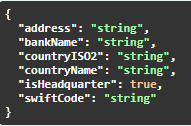
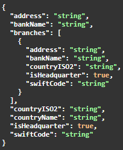
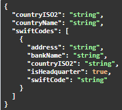

# SWIFT-service
A swift SWIFT service using GoLang and Redis. It enables a simple API that includes 4 endpoints, which utilizes Redis backend to manage SWIFT code database.

## Contents
- [How to run](#how-to-run)
    - [As a container using Docker](#as-a-container-using-docker)
    - [Local set-up](#local-set-up)
- [Usage](#usage)
    - [Endpoints](#endpoints)
    - [Migratio app](#migration-app)
    - [Environment variables](#environment-variables)

## How to run
Therer are 2 possible options to run this service - as a container with Docker, or locally

Additionally, I used Makefle for streamlining commands - in this documentation I'll refer to them. If you do not want to work with makefile just check out the command and dependencies hiding behind each make command. In other case, [check out this post](https://stackoverflow.com/questions/32127524/how-to-install-and-use-make-in-windows)

### As a container using Docker
For this you just need to install [Docker](https://docs.docker.com/get-started/get-docker/).
Start with cloning this repository where you want and go inside it:
```bash
cd your/folder
git clone https://github.com/DroppedHard/SWIFT-service.git
cd SWIFT-service
```

Then run the docker-compose script with this command:
```bash
docker-compose up --build -d    # or make compose-up
```

After the command finishes you can start using the service!

Docker compose should:
1. Install latest Redis instance
2. Build the main and migration apps
3. Populate the Redis database with initial data - [more info](#migration-app)
4. Open port 8080 for api container

### Local set-up
But in case of running it locally please install:
- [GoLang](https://go.dev)
- [Redis](https://redis.io) - recommended as a Docker instance with proper [environment variables](#environment-varialbes)

Start with initializing your Redis instance, as it is required for startup

Now start with running this commands in root directory:
```bash
make install
make run
```

If you encounter this error:
```bash
(...) connectex: No connection could be made because the target machine actively refused it.
```
your connection to Redis instance does not work:
- Verify that Redis instance is running
- Check your [environment variables](#environment-varialbes) - especially:
    - DB_HOST
    - DB_PORT
    - DB_NUM (in case you wish to use different than default 0)
    - And other variables to modify how connection should work

until you see logs like this:
```bash
Succesfully connected!
Listening on localhost:8080
```

## Usage

For detailed endpoint description, try out the SwaggerUI, which should work under `http://localhost:8080/v1/swagger/index.html` when run locally.

### Endpoints

App hosts 5 endpoints:
- GET /v1/health - simple health check
- POST /v1/swift-codes - Add bank data to the system
    - request data will be verified, so check the correctiness of given data
    - accepts data in the following format:
    
    
- DELETE /v1/swift-codes/{swiftCode} - Delete bank data from the system by SWIFT code
- GET /v1/swift-code/{swiftCode} - Get bank data with given SWIFT code
    - In case of Headquarters, all saved branches will be retrieved
    - success response:

    
- GET /v1/swift-code/country/{countryISO2} - Get banks data with given country code
    - success response:
        
        


### Migration app

To populate database with initial data I created a separate migration app, which you can run using `make migrate` (GoLang required). By defulat it uses the [initial data CSV file](./cmd/migrate/migrations/initial_data.csv) to populate the data. The file should have the folowing collumns:
1. SWIFT CODE (11 char code, [example](https://www.remitly.com/us/en/swift-codes/poland/albpplpwxxx/alior-bank-spolka-akcyjna))
2. NAME (bank name)
3. ADDRESS (bank address)

Country Name, country ISO2 code and whether the bank is a headquarters or not will be derrived from the SWIFT code, so be sure about its correctiness.

In case you want to use a different migration file, please use:
```bash
make migrate-file source="./path/to/your/file"
```
This requires working [local set-up](#local-set-up)

### Environment variables

In case you want to make this app work differently, you can utilize the following envorimnent variables, by declaring them in your .env file in root directory:
- PUBLIC_HOST and PORT to change the name under which it will be hosted
- MIGRATION_FILE - default path for migration file
- Database setup:
    - DB_PASSWORD, DB_HOST, DB_PORT, DB_NUM - for connection with Redis instance
    - DB_TEST_NUM - to choose which DB number will be used for testing
    - DB_POOL_SIZE, DB_MIN_IDLE_CONNS - connection limiters for Redis DB

Default values depend whether it is a local run, or as a Docker compose. 
